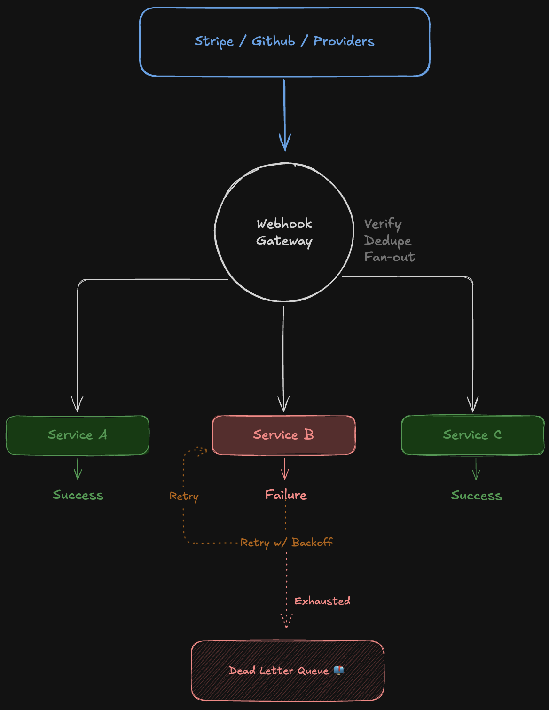

# Webhook Gateway

A single-binary webhook gateway that receives incoming webhooks, verifies signatures, and fans out to multiple destinations with retries and a dead letter queue. All behavior is driven by a YAML config file.

## Features

- **Signature verification** — HMAC-SHA256 (GitHub, GitLab, etc.) and Stripe's non-standard `t=,v1=` format with replay protection
- **Fan-out** — deliver to multiple destinations concurrently per route
- **Retries** — exponential backoff with jitter, distinguishes retryable (5xx, network) from non-retryable (4xx) errors
- **Deduplication** — in-memory idempotency store with configurable TTL, per-route
- **Dead letter queue** — failed deliveries saved as JSON files for inspection or replay
- **Request tracing** — every inbound webhook gets a UUID that flows through delivery, retries, and dead letter entries
- **Header allowlisting** — control exactly which headers are forwarded to destinations
- **Body size limiting** — caps inbound payloads to prevent memory exhaustion
- **Concurrency limiting** — cap total in-flight destination deliveries
- **HTTPS enforcement** — destinations must use HTTPS; plain HTTP is rejected at config load
- **SSRF protection** — config-time rejection of private/loopback/link-local IPs and `localhost`, plus a runtime DNS-aware dialer that checks all resolved IPs before connecting
- **Graceful shutdown** — drains in-flight deliveries on SIGINT/SIGTERM



## Quick Start

```
go build -o webhook-gateway .
cp config.yaml.example config.yaml
# edit config.yaml — set your routes, destinations, and env var names
GITHUB_WEBHOOK_SECRET=your-secret ./webhook-gateway
```

Pass a custom config path with `-config`:

```
./webhook-gateway -config /etc/webhook-gateway/config.yaml
```

## Configuration

See [`config.yaml.example`](config.yaml.example) for a fully annotated example. The key concepts:

### Routes

Each route maps an inbound path to one or more destinations:

```yaml
routes:
  - path: /hooks/github
    signature:
      type: hmac-sha256        # or "stripe"
      header: X-Hub-Signature-256
      secret_env: GITHUB_WEBHOOK_SECRET
      prefix: "sha256="        # optional — stripped before verifying
    destinations:
      - url: https://service-a.example.com/webhook
        timeout: 10s
      - url: https://service-b.example.com/webhook
        timeout: 5s
    forward_headers:
      - X-GitHub-Event
      - X-GitHub-Delivery
    retry:
      max_attempts: 3
      initial_interval: 1s
      max_interval: 30s
```

### Secrets

Secrets are always read from environment variables via `secret_env`, never stored inline in the config file.

### Signature Types

| Type | Provider | Notes |
|------|----------|-------|
| `hmac-sha256` | GitHub, GitLab, generic | Configurable `prefix` and `encoding` |
| `stripe` | Stripe | Parses `t=,v1=` header, checks `tolerance` window |

### Idempotency

Enable per-route to skip duplicate deliveries. Useful for providers like Stripe that retry aggressively:

```yaml
idempotency:
  enabled: true
  ttl: 24h
  key_path: id    # dot-separated path into the JSON body (e.g. "data.object.id")
```

If the key path is missing or the body isn't valid JSON, deduplication is skipped and delivery proceeds normally.

### Dead Letter Queue

Failed deliveries (after all retry attempts) are written as JSON files:

```yaml
dead_letter:
  type: file
  path: ./dead_letters
  store_body: true          # false to omit payload (e.g. for PII)
  max_body_bytes: 1048576   # truncate stored bodies
```

Each file contains the request ID, route, destination, headers, error, and attempt count.

### Header Forwarding

The gateway always forwards `Content-Type` and `X-Webhook-Gateway-Request-Id`. Additional headers are forwarded via the `forward_headers` allowlist. Hop-by-hop headers and `Host` are never forwarded.

## How It Works

1. Webhook arrives at a configured path
2. Signature is verified against the raw body
3. If idempotency is enabled, the event ID is checked — duplicates get a `200` with no delivery
4. The gateway returns `200` to the provider immediately
5. Deliveries fan out to all destinations concurrently in the background
6. Failed deliveries (after retries) go to the dead letter queue

## Security

The gateway enforces defense-in-depth against SSRF and payload exposure:

**Config-time validation** rejects destinations at startup if the URL scheme is not `https`, or if the hostname is `localhost` or a literal private/loopback/link-local IP (e.g. `127.0.0.1`, `10.x`, `169.254.169.254`).

**Runtime DNS-aware blocking** uses a custom `DialContext` that resolves the destination hostname, checks *all* returned IPs against a blocklist (loopback, RFC 1918, link-local, unspecified), and refuses to connect if any IP is private. This catches DNS rebinding and hostnames that resolve to internal addresses.

Both layers can be bypassed with `allow_insecure: true` in the server config for local development:

```yaml
server:
  allow_insecure: true    # disables HTTPS and SSRF checks — never use in production
```

## Running Tests

```
go test -race ./...
```

## Dependencies

- [`gopkg.in/yaml.v3`](https://github.com/go-yaml/yaml) — YAML parsing
- Standard library for everything else

## License

MIT
